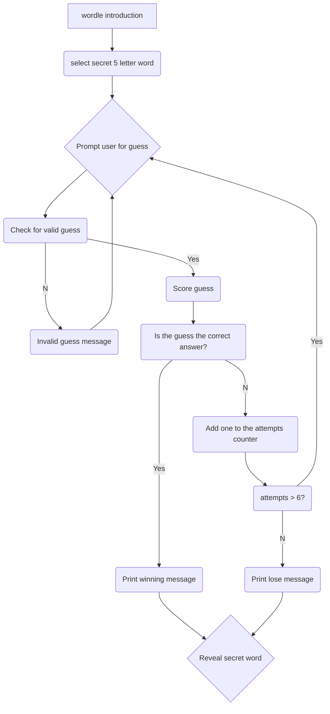
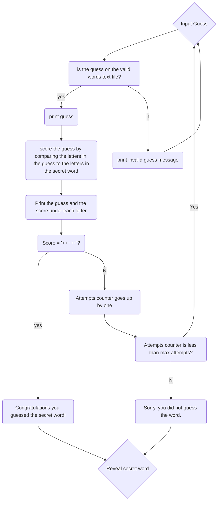

## **Game Algorithm**

```mermaid
flowchart TD
    A[wordle introduction] --> B(select secret 5 letter word)
    B --> C{Prompt user for guess}
    C --> D(Check for valid guess)
    D --Yes--> E(Score guess)
    D --No--> F(Invalid guess message)
    F -->C
    E --> G(Is the guess the correct answer?)
    G --Yes--> H(Print winning message)
    G --No--> I(Add one to the attempts counter)
    I --> J(attempts > 6?) --No--> K(Print lose message)
    J --Yes-->C
    H --> L{Reveal secret word}
    K --> L
```
## **Scoring Algorithm**

```mermaid
flowchart TD
    A{Input Guess} --> B(is the guess on the valid words text file?)
    B --yes--> C(print guess)
    B --no--> D(print invalid guess message) --> A
    C --> E(score the guess by comparing the letters in \n the guess to the letters in the secret word)
    E --> F(Print the guess and the score under each letter)
    F --> G(Score = '+++++'?)
    G--yes--> H(Congratulations you guessed the secret word!)
    G--No--> I(Attempts counter goes up by one)
    I-->J(Attempts counter is less than max attempts?)
    J--Yes-->A
    J--No-->K(Sorry, you did not guess the word.)
    K-->L{Reveal secret word}
    H-->L
    
```